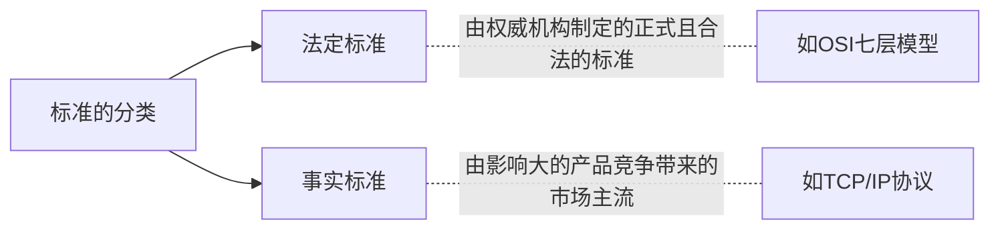

# 第一章 计算机网络体系结构

Typora v0.10.10 (GitHub theme)

Syntax mermaid v8.8.3

[TOC]

## 1.1 计算机网络的体系

### 1.1.1 计算机网络的概念

1. **计算机网络**是一个将分散的、具有独立功能的**计算机系统**，通过**通讯设备**与**通信链路**连接起来，由功能完善的**软件**实现**资源共享**和**信息传递**的系统。

- **网络拓扑结构**：网络拓扑结构包含**计算机系统**、**通讯设备**和**线路**
- **计算机系统**：如Windows，macOS，iOS，Android等。系统的开发者需要遵循网络通行规则进行适配
- **通讯设备**：通常指交换机和路由器
- **通信链路（线路）**：指网络连接的介质，如网线、光纤、无线电波等
- **软件**：在硬件和操作系统构成的**网络拓扑结构**的基础上，实现**资源共享**和**信息传递**这两个功能

2. **计算机网络**是**互联**的、**自治**的计算机集合。

- **互联**：指各个计算机通过**通信链路**互相连通
- **自治**：指各个计算机直接没有主从关系

### 1.1.2 计算机网络的组成

1. **按组成部分分为：硬件+软件+协议**

- 硬件：**主机**、**通讯设备**、**通信链路**

- 软件：**计算机系统**、**应用软件**

- 协议：一系列网络通用规则规范的集合

2. **按工作方式分为：边缘部分+核心部分**

- 边缘部分：用户直接使用的电脑主机。使用**C/S（客户端-服务器）**或**P2P（对等）**的方式

- 核心部分：运营商网络、DNS服务器等

3. **按功能组成分为：通信子网+资源子网**

- [**通信子网**](#通信子网)：用于数据通信

- [**资源子网**](资源子网)：用于资源共享和数据处理
- \# OSI七层模型中，上三层为[**资源子网**](资源子网)，下三层为[**通信子网**](#通信子网)，中间的传输层作为过渡

### 1.1.3 计算机网络的功能

1. **数据通信**
2. 硬件**资源共享**（如打印机）
3. 软件**资源共享**（如网页版的应用程序）
4. 数据**资源共享**（如网盘）
5. **分布式处理**实现**负载均衡**（服务器等大型计算机集群）
6. **提高可靠性**（**网络拓扑结构**中不同计算机之间的路径冗余）

### 1.1.4 计算机网络的分类

1. **按分布范围分为**：<u>广域网WAN（交换技术）</u>，城域网MAN，<u>局域网LAN（广播技术）</u>，个人区域网PAN

2. **按使用者分为**：公用网（电信移动联通等），专用网（政府军队银行等）

3. **按交换技术分为**：电路交换，报文交换，分组交换

4. **按拓扑结构分为**：总线型，星型，环型，网状型（常用于<u>广域网WAN</u>）

5. **按传输技术分为**：广播式网络（共享公共通信信道），点对点网络（使用**分组存储转发**和**路由选择**机制）

### 1.1.5 标准化工作

<h4>要实现不同厂商的软硬件之间的相互连通，必须遵从统一的标准。</h4>

#### 1.1.5.1 网络标准的分类

#### 1.1.5.2 因特网标准产生流程

RFC（Request For Comments）:

#### 1.1.5.3 标准化工作相关组织

1. 国际标准化组织ISO（[OSI参考模型](#OSI)，HDLC协议）
2. 国际电信联盟ITU（制定通信规则）
3. 国际电气电子工程师协会IEEE（IEEE802系列标准，5G标准）
4. 因特网工程任务组IETF（[RFC](#RFC)流程中对标准的审核制定）

### 1.1.6 性能指标

#### 1.1.6.1 速率

速率即**数据率**或称**数据传输率**或**比特率**（比特bit，即二进制字节），是连接在计算机网络上的主机在数字信道上传送数据位数的速率。

单位有b/s，kb/s，Mb/s，Gb/s，Tb/s等。

#### 1.1.6.2 带宽

1. **带宽**原本指某个信号具有的频带宽度，即最高频率与最低频率之差，单位Hz赫兹。
2. 计算机网络中，**带宽**用来表示网络的通信线路传达数据的能力，通常指单位时间内从网络中的某一点到另一点所能通过的**最高数据率**，即[速率](#速率)。

## 1.2 计算机网络的结构

### 1.2.1 OSI七层参考模型

|                       子网类型                       |            层             |       概念       |
| :--------------------------------------------------: | :-----------------------: | :--------------: |
| [**资源子网**](资源子网)  |     [应用层](#应用层)     |     使用数据     |
| [**资源子网**](资源子网)  |     [表示层](#表示层)     |     使用数据     |
| [**资源子网**](资源子网)  |     [会话层](#会话层)     |    数据的处理    |
|                         过渡                         |     [传输层](#传输层)     | 数据的打包、拆包 |
| [**通信子网**](#通信子网) |     [网络层](#网络层)     |      路由器      |
| [**通信子网**](#通信子网) | [数据链路层](#数据链路层) |   交换机，网桥   |
| [**通信子网**](#通信子网) |     [物理层](#物理层)     |  集线器，中继器  |

